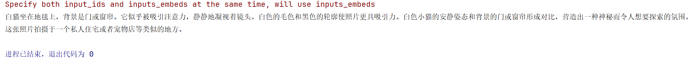
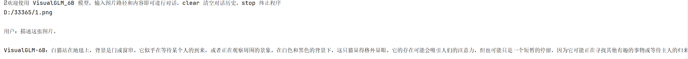
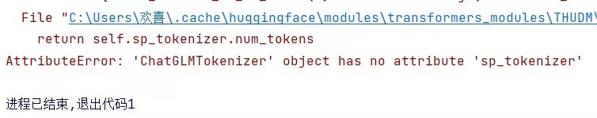
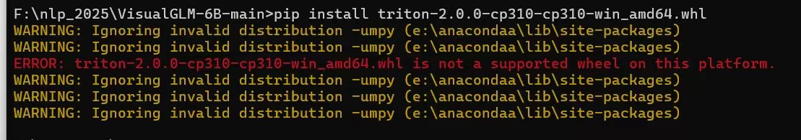
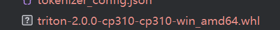
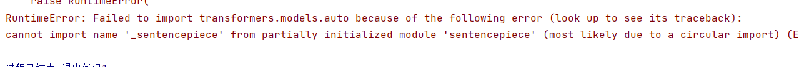

# 第一次实验文档
## ⭐️本地大模型介绍（ VisualGLM-6B）
VisualGLM-6B 是一个开源的，支持图像、中文和英文的多模态对话语言模型，语言模型基于ChatGLM-6B，具有 62 亿参数；图像部分通过训练BLIP2-Qformer构建起视觉模型与语言模型的桥梁，整体模型共78亿参数。

VisualGLM-6B 依靠来自于CogView 数据集的30M高质量中文图文对，与300M经过筛选的英文图文对进行预训练，中英文权重相同。该训练方式较好地将视觉信息对齐到ChatGLM的语义空间；之后的微调阶段，模型在长视觉问答数据上训练，以生成符合人类偏好的答案。

VisualGLM-6B 由SwissArmyTransformer(简称`sat`) 库训练，这是一个支持Transformer灵活修改、训练的工具库，支持Lora、P-tuning等参数高效微调方法。

## ⭐️部署使用

### 模型推理（Ubuntu部署）

使用pip安装依赖
```
# 使用aliyun镜像，命令如下
pip install -i https://mirrors.aliyun.com/pypi/simple/ -r requirements.txt
```
本地下载Huggingface模型，再把模型文件传上去

完整模型地址：https://huggingface.co/THUDM/visualglm-6b
从 Hugging Face Hub 下载模型需要先安装Git LFS

安装Git LFS：
```
sudo apt-get install git-lfs
```
然后验证安装是否成功：
```
$ git lfs install
```
若显示如下则安装成功
```
> Git LFS initialized.
```

下载成功后Hugging Face Hub 下载模型，运行：
```
git clone https://huggingface.co/THUDM/visualglm-6b
```
如果从 Hugging Face Hub 上下载 checkpoint 的速度较慢，可以只下载模型实现
```
GIT_LFS_SKIP_SMUDGE=1 git clone https://huggingface.co/THUDM/visualglm-6b
```


再从原项目提供的清华云盘中手动下载模型参数文件，并将下载的文件替换到本地的visualglm-6b目录下。
主要模型文件清华云盘地址：https://cloud.tsinghua.edu.cn/d/43ffb021ca5f4897b56a/

也可以从Hugging Face镜像网站中下载，地址：https://hf-mirror.com/THUDM/visualglm-6b

然后把所有出现THUDM/visualglm-6b的地方全部换成下载模型的目录visualglm-6b，包括测试代码，cli_demo_hf.py

在主目录新建test.py，粘贴官方给出的代码：

```python
from transformers import AutoTokenizer, AutoModel
tokenizer = AutoTokenizer.from_pretrained("THUDM/visualglm-6b", trust_remote_code=True)
model = AutoModel.from_pretrained("THUDM/visualglm-6b", trust_remote_code=True).half().cuda()
image_path = "your image path"
response, history = model.chat(tokenizer, image_path, "描述这张图片。", history=[])
print(response)
response, history = model.chat(tokenizer, image_path, "这张图片可能是在什么场所拍摄的？", history=history)
print(response)
```

更换文件加载路径，将your image path换成图片的绝对路径，
命令行执行：
```shell
python test.py
```
等待加载模型，传回文字即为成功



## ⭐️部署工具

### 命令行 Demo
因为我们是使用的Huggingface模型，所有都执行带-hf的文件，更换THUDM/visualglm-6b为visualglm-6b，命令行执行：

```shell
python cli_demo_hf.py
```

输入准备好的图片的绝对路径

测试成功：


## ⭐️模型量化
在Huggingface实现中，模型默认以 FP16 精度加载，运行上述代码需要大概 15GB 显存。如果 GPU 显存有限，可以尝试以量化方式加载模型。
使用方法如下：
```python
# 按需修改，目前只支持 4/8 bit 量化。下面将只量化ChatGLM，ViT 量化时误差较大
model = AutoModel.from_pretrained("THUDM/visualglm-6b", trust_remote_code=True).quantize(8).half().cuda()
```


## ⭐️部署中的问题处理
总结了部署中存在的问题及解决方案：

1.模型框架从官方网站下载速度过慢，解决办法为找到了合适的镜像网站下载模型框架，模型从官方网盘中下载。

- 模型框架镜像：
```
GIT_LFS_SKIP_SMUDGE=1 git clone https://hf-mirror.com/THUDM/visualglm-6b
```

- 模型下载的网盘地址：
```
https://cloud.tsinghua.edu.cn/d/43ffb021ca5f4897b56a/
```

2.遇到以下问题，解决方法为降低transformer的版本。

- 问题：
  

- 降低版本解决问题：
```
pip install transformers==4.27.1
```

3.对于Windows系统(Linux不用)没有模型‘triton'问题，首先将python版本升或降为python3.10，再下载triton。

- 问题：
  
- 下载解决问题：



4.对于module’sentencepiece'问题，在conda中下载相关配置即可。

- 问题：

- 下载以解决问题：
```
conda install -c huggingface safetensors
```

## ⭐️HTTP封装
我们基于Flask框架进行HTTP POST请求处理程序。

Flask 是一个轻量级的 Python Web 框架，设计简单而灵活，适用于快速开发 Web 应用程序和 API。
它由 Armin Ronacher 在2010年创建，遵循 BSD 许可证，因其简洁、易学和可扩展性而备受开发者喜爱。

它监听 /get_response 路径，并期望以 POST 方法接收数据。当收到请求时，它从请求表单中提取 user_input（用户文本输入）、prompt_type（任务类型） 和 model_type（模型选择） 数据。
然后它将 user_input 转换为字符串类型，并调用 text_replay 函数生成回复。最后，它将回复打包成 JSON 格式的响应并返回给客户端。

```python
@app.route('/get_response', methods=['POST'])
def get_response():
    user_input = request.form['user_input']
    prompt_type = request.form['prompt_type']
    model_type = request.form['model_type']
    print(prompt_type)
    print(model_type)
    user_input = str(user_input)
    reply = text_replay(user_input)
    reply = str(reply)
    return jsonify({'response': reply})
```
## ⭐️网页实现
我们使用JavaScript实现一个建议的操作界面，提高项目的易用性。

1.选择prompt_type

KE1:给定一段文本，抽取其中常识知识三元组，每一个三元组的组织形式为（头实体，关系，尾实体）。

KE2:给定一段文本，抽取其中存在的命名实体（人物、地点、机构等），分每一个类别存储。

KE3:给定一段文本，以及指定的实体（任五、地点、机构等），抽取与该实体相关的Key-Value知识。
```html
<select id="prompt-select-box">
    <option value="KE1">KE 1</option>
    <option value="KE2">KE 2</option>
    <option value="KE3">KE 3</option>
</select>
```


2.选择model_type

Local-Glm:使用本地模型进行抽取

ChatGpt：使用远程Chatgpt进行知识抽取
```html
<select id="model-select-box">
    <option value="Local-GLM">Local-GLM</option>
    <option value="ChatGpt">ChatGpt</option>
</select>
```


3.前后端数据交换

```html
var selectedValue1 = document.getElementById("prompt-select-box").value;
var prompt_type = selectedValue1;
var selectedValue2 = document.getElementById("model-select-box").value;
var model_type = selectedValue2;
var userInput = document.getElementById("user-input").value;

if (userInput.trim() !== "") {
    // 获取用户输入的内容
    var chatBox = document.getElementById("chat-box");

    // 用户消息
    var userMessageContainer = document.createElement("div");
    userMessageContainer.classList.add("message-container", "user-message-container");

    var userMessage = document.createElement("div");
    userMessage.classList.add("message", "user-message");
    userMessage.textContent = userInput;

    var userAvatar = document.createElement("div")
    userAvatar.textContent = 'ME'
    userAvatar.classList.add("avatar-text")


    userMessageContainer.appendChild(userAvatar);
    userMessageContainer.appendChild(userMessage);
    chatBox.appendChild(userMessageContainer);

    // 向后端发送用户输入并获取回复
    fetch('/get_response', {
        method: 'POST',
        headers: {
            'Content-Type': 'application/x-www-form-urlencoded',
        },
        body: 'user_input=' + encodeURIComponent(userInput)+ '&prompt_type=' + encodeURIComponent(prompt_type)+'&model_type=' + encodeURIComponent(model_type),
    })
```
**(1)**
fetch('/get_response', ...)：这是Fetch API的基本用法之一。它指示浏览器向服务器发出HTTP请求，请求的目标URL是/get_response。这个URL通常是服务器上的一个端点，用于处理客户端的请求。

**(2)**
method: 'POST'：指定了HTTP请求的方法为POST，这意味着我们将向服务器发送数据并执行相应的操作。

**(3)**
headers: { 'Content-Type': 'application/x-www-form-urlencoded' }：这里设置了请求头，指定了请求体的内容类型为application/x-www-form-urlencoded。这种内容类型通常用于发送表单数据。

**(4)**
body: 'user_input=' + encodeURIComponent(userInput) + '&prompt_type=' + encodeURIComponent(prompt_type) + '&model_type=' + encodeURIComponent(model_type)：这是请求体，包含了要发送给服务器的数据。数据以URL编码的形式构建，各个字段之间用&符号分隔。encodeURIComponent函数用于将数据进行URL编码，以便在HTTP请求中正确传输特殊字符和空格。
